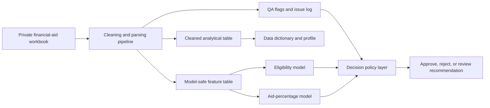

# Architecture

This project was designed as a governed financial-aid analytics workflow, not as a raw prediction notebook.

## Pipeline Overview

## Main Design Ideas

- Preserve raw evidence while producing parsed and inferred fields.
- Separate audit-only fields from model-safe features.
- Treat ambiguous rows as review candidates instead of silently forcing a prediction.
- Avoid post-decision leakage from award, committee, and outcome columns.
- Compare models with calibration, interpretability, and governance needs in mind.
- Translate model scores into operational actions rather than presenting scores alone.

## Notebook Responsibilities

- `financial_aid_cleaning.ipynb` documents the cleaning and feature-engineering pipeline.
- `test_financial_aid_cleaning.ipynb` mirrors parser, schema, export, and workflow tests.
- `financial_aid_decision_analysis.ipynb` connects predictive results to policy choices.
- `financial_aid_eligibility_model.ipynb` handles binary eligibility classification.
- `financial_aid_percentage_model.ipynb` handles aid-percentage estimation.
- `purchasing_power_experiment.ipynb` tests the impact of purchasing-power assumptions.

## Public Repository Boundary

The public repo intentionally stops before private data, row-level generated outputs, model bundles, and thesis submission material. The notebooks show the approach; a complete rerunnable version would need synthetic data and reconstructed source modules.

